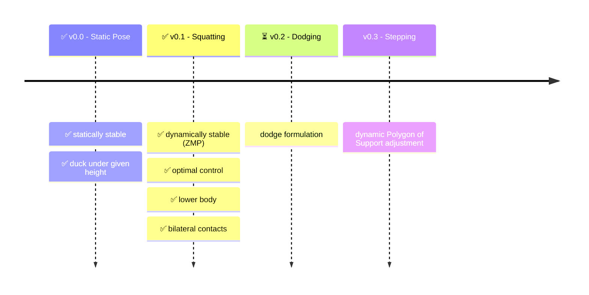

<div align="center">
<h1>🥋 PROJECT NEO</h1>
<h4>Getting He1nz to dodge bullets like the chosen one.</h4>

<a href="https://github.com/DominicZahn/Project_Neo/blob/main/docu/ProjectNeo.pdf">
    
</a>
<a href="https://github.com/DominicZahn/Project_Neo/blob/main/docu/projectNeo/ProjectNeo/ProjectNeo.pdf">
    
</a>
</div>

# Quick Start

To get started recursively clone the repository with

```git
git clone --recursive https://github.com/DominicZahn/ROS2-Gazebo-Docker.git
```

It is important that the subrepositories [Neo-Construct](https://github.com/DominicZahn/Neo-Construct/tree/main) and [ros2_heinz](https://github.com/K-d4wg/ros2_heinz/tree/6d28be5d449fc5cbbe89e5be2110f219c400cbe9) are included.

## Setup and Docker Control

The general interaction with the Docker container can be seen in the subrepository [Neo-Construct](https://github.com/DominicZahn/Neo-Construct/tree/main).

## Launch `Neo`

Inside the docker the main 'neo' formulation can be launched with the following command.

```bash
ros2 run dodge_it_py neo
```

This implementation is still actively worked on so it is subject to change.
Below we present the roadmap for Project Neo.


