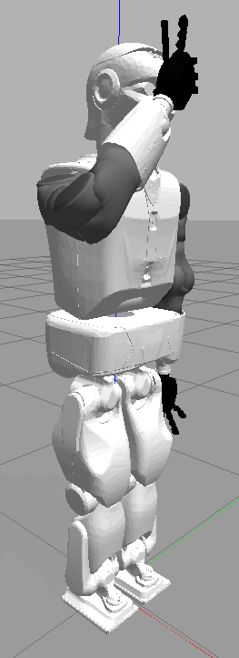
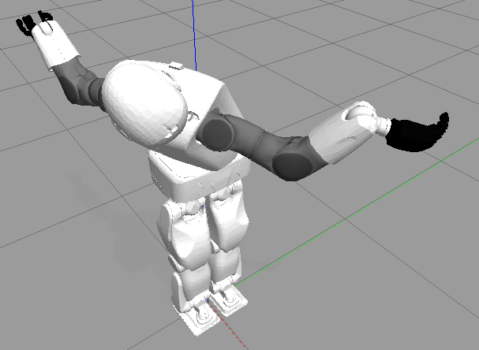
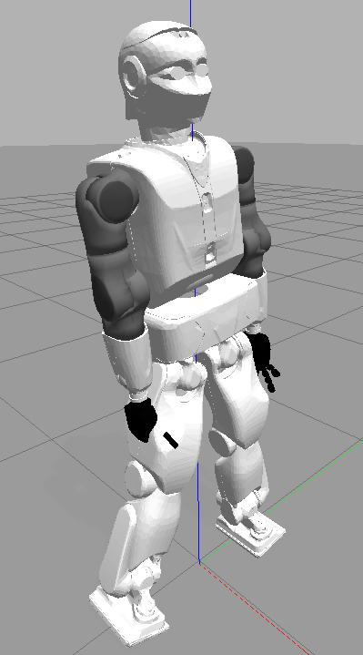
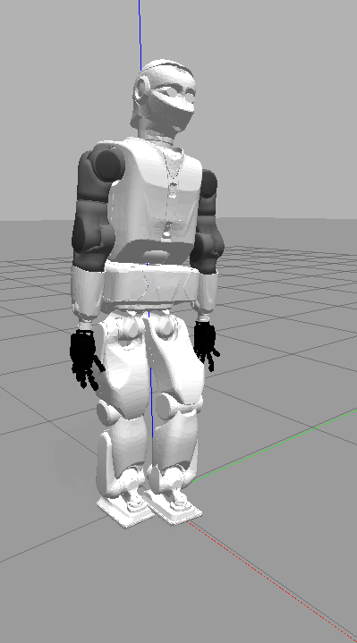
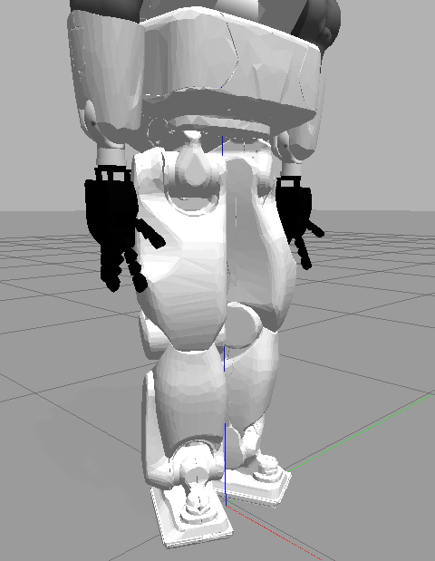
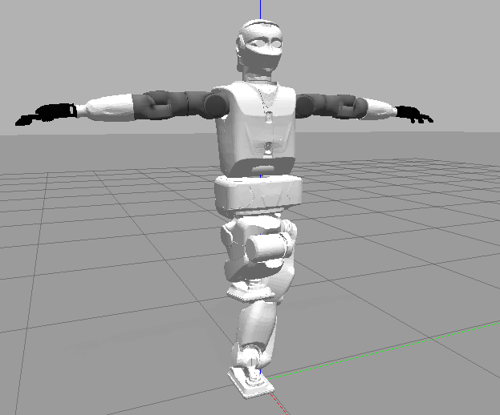
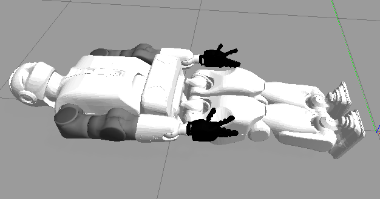
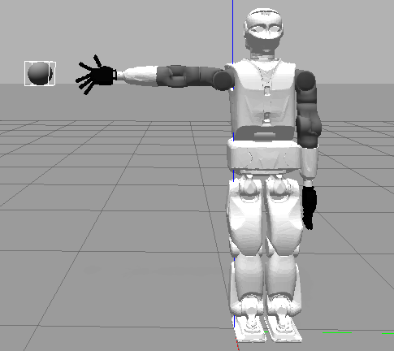
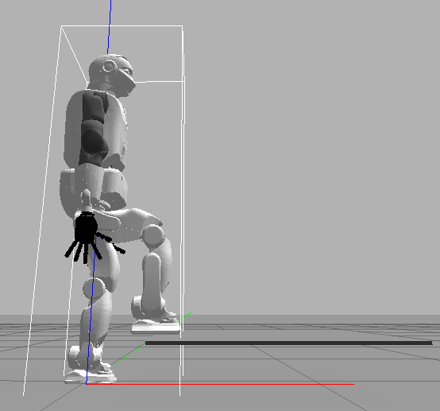
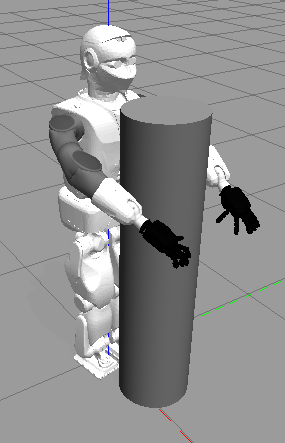

# Exercise 1
**Prof. Dr. Katja Mombaur**

**Humanoid Robotics ‑ Locomotion and Whole‑Body Control (SS 2025)**

**Exercise Sheet No. 1**

**Due: May 19, 2025**

---

## 1.1 – The Reem‑C Model

Familiarize yourself with the Reem‑C model provided in the devcontainer or as a file with this sheet. Look at the different parameters in the model file and understand what they mean. Also have a look at the different states used to describe the robot and their order.

Use RViz to visualize the robot standing upright with stretched legs and arms hanging down, and then modify the model as follows (make a copy of the original file before you start):

1. **Default**
   Visualize the model with the parameter values as defined in the original file.
   

2. **Longer Right Arm**
   Increase the length of the right arm by 50% (both upper and lower arm segments).

   ```yaml
   TBD
   ```

3. **Shorter Left Leg**
   Decrease the length of the left leg by 30% (both thigh and shank segments) and reset the right arm parameters to normal.
4. **Taller Pelvis**
   Double the height of the pelvis segment and reset the left leg parameters to normal.

> *Tip:* Prepare a screenshot or load each modified model on demand in RViz to demonstrate your changes.

## 1.2 – Forward Kinematics

Change the joint angles of the Reem‑C model to achieve the following configurations (as shown in class for the biped robot):

> Angles where set using `rqt`

1. Set all joint angles of the upper body (from pelvis upward) to **0.3 rad**, all other joints to **0**.
> Used 1.18° instead of 0.3 rad. Head and torso yaw are set to max.
> The follwing controllers have all there values set:
> - `head_controller`
> - `torso_controller`
> - `left_arm_controller`
> - `left_hand_controller`
> - `right_arm_controller`
> - `right_hand_controller`


2. Set the **roll angle** of the **right hip** to **30°** outward from vertical, all other joints to **0**.
> `right_leg_controller` --> `leg_right_2_joint`


3. Set the **pitch angles** of the **left hip and knee** to **30°** flexion each.
> `left_leg_controller`--> -`leg_left_3_joint`, +`leg_left_4_joint`



4. Set the **ankle yaw** angles to **90°** outward (forming the first position in ballet).
> `*_leg_controller` --> `leg_*_1_joint`



5. Choose **three more** combinations of joint angles to explore interesting configurations (indicate your chosen values).
> `arm_left_2_joint`= 1.50
> `arm_right_2_joint`= 1.50
> `leg_right_3_joint` = -1.56
> `leg_right_4_joint`= 2.58
> `leg_right_5_joint`= -1.19
> `leg_left_2_joint`= -0.23
> `leg_left_4_joint`= 0.03
> `leg_left_6_joint`= 0.23


> *Tip:* Save and label screenshots for each pose, and note the exact joint values you used.

## 1.3 – Inverse Kinematics (Manual Trial & Error)

Use manual trial-and-error to place Reem‑C in the following configurations:

1. **Supine**: Lying flat on its back touching the floor with the pelvis segment.
> `leg_right_5_joint` = 0.31
> `torso_controll` = -0.21


2. **High Reach**: Standing upright and touching a point at **1.30 m** height with the right hand (find one valid solution).
> `arm_right_2_joint` = 0.58


3. **Stair Step**: Standing upright and placing the left foot on a **20 cm** high stair, **20 cm** in front of the original foot position.
> Ungefähr an der richtigen Stelle, Stufe ist sehr dünn und 0.8 placement
> `leg_right_3_joint`= -1.30
> `leg_right_4_joint`= 1.30


4. **Your Choice**: Define and solve one additional inverse kinematics task of interest.
> `arm_*_1_joint` = 1.29
> `arm_*_2_joint` = 0.11
> `arm_*_3_joint` = -2.00
> `arm_*_4_joint` = 0.5


> *Tip:* Document each solution with joint values and screenshots.

## 1.4 – Jacobian of the Arm

Write a program to compute the Jacobian of the **right hand** of Reem‑C with respect to its **right shoulder**, assuming the shoulder is fixed in space.
Test your implementation for:

* A couple of **non‑singular** configurations.
* At least one **singular** configuration.

Have your code and visualizations ready (text form with pictures or live demonstration).

## 1.5 – BONUS Task: Jacobian of the Upper Body

Extend your Jacobian program to the **whole upper body**: assume the **pelvis** segment is fixed and compute the Jacobians for **both hands**.
Test for non‑singular and singular configurations.

## 1.6 – BONUS Task: Manipulability

Write a program to evaluate manipulability according to the three measures covered in class. Your program should:

1. Take an arbitrary $6\times n$ or $3\times n$ Jacobian matrix $J$.
2. Compute the matrix $A$ as defined in class.
3. Compute the three manipulability measures.

Test your program with several example matrices. Prepare code and visualizations.

