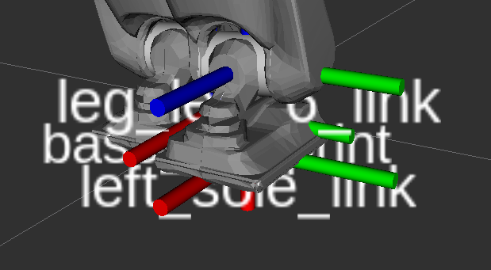

# Exercise 2
**Prof. Dr. Katja Mombaur**

**Humanoid Robotics ‑ Locomotion and Whole‑Body Control (SS 2025)**

**Exercise Sheet No. 2**

**Due: June 5, 2025**

---

### 0.0 General Questions
> *Controller Manager does not seem to launch properly in rviv launch file!*

> *Better way to structure package? So that intellisense works!*

> *Why is the full tf chain not loaded at the start of the programm?*

> *How to set the start position correctly?*

> *How to reset rviz from python? Good rviz api?*
> -> not necessary if sim time used

> *Best way to retrieve robot info URDF?*

> *Second run always results in wrong tf tree. Or not????ß*

> *Is it correct that the force-torque-sensor is located in the ankle?*
> `<!--xacro:reemc_force_torque_sensor name="leg_left_6_link"  update_rate="100.0"/-->`
> 
> top to bottom: `leg_left_6_link`, `base_footprint`, `left_sole_link`
>

> *Is the `base_link` center also the pelvis center?*
/
> *One foot is under $z=0$ of `odom` and `base_footprint`.*

> *What is the best way to do numerical integration? rt vs. precision*

> *Is there a good way to use Vector3, Point, etc?*

### 0.1 Knowledge gained
#### 0.1.1 Fixing extrapolation error in Rviz
- set to `\use_sim_time` param to `true`
- execute `rosbag` with `--clock` to publish rosbag time to `/clock` topic

#### 0.1.2 Fixing reset after each execution
- use sim time (0.1.1)

### 2.1 – Reem-C’s center of mass

Write a program that:

- reads all segment masses and segment center of mass locations of Reem-C  
- calculates the total mass of the robot and prints it out  
- calculates the total center of mass of the robot as a function of its joint angles and prints it out  
- computes the distance of his center of mass to the center of the pelvis segment (x, y, z, distance) and prints it out  

Apply this program to the data set given in the attachment. You can play this data via:

Visualize the total center of mass and the center of the pelvis segment for the entire motion.  
Prepare a video or live demo of this visualization, the results of the printouts as well as all your relevant code.

---

### 2.2 – Center of pressure

Write a program that computes the center of pressure location based on the measurements of the force torque sensors, and prints out x,y coordinates of the COP. All relevant parameters can be found in the Reem-C model.

Apply this program to the data set given in the attachment.  
Visualize the center of pressure for the entire motion.  
Prepare a video or live demo of this visualization, the results of the printouts as well as all your relevant code.

---

### 2.3 – Zero moment point

Write a program that computes the zero moment point from the motion of the robot following the three approaches discussed in the class and prints them out:

1. exact computation of ZMP taking all contributions into account  
2. simplified computation of ZMP taking only translations of segments into account  
3. even more simplified computation of the ZMP approximating the robot by a single mass point.  
   Assume here that this mass point (total mass of the robot) is aligned with the pelvis motion of the robot.

Apply this program to the data set given in the attachment.  
Visualize all three computations of the ZMP for the entire motion - preferably also showing the COP from the last exercise.  
Prepare a video or live demo of this visualization, the results of the printouts as well as all your relevant code.
