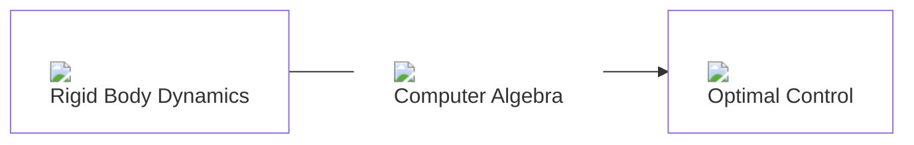
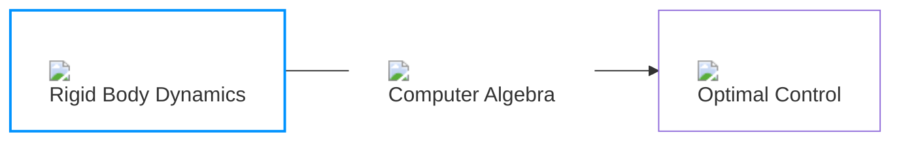

# Ducking H1-2

---
title: Simple Example Showcase
layout: image-right
image: /recordings/arm-vertical.GIF
backgroundSize: contain
class: text-center
---

# Simple Example
#### 3-Segment Arm

---
title: OCP Formulation
layout: image-right
image: /recordings/arm-vertical.png
class: text-right
---

# OCP Formulation

$$
\begin{align}
x(t) &=
\begin{bmatrix}
q(t) \\ \dot q(t) \\
\end{bmatrix}
\\
\nonumber \\
u(t) &= \tau(t) \\
\nonumber \\
f_{expl}(x(t), u(t), t) & =
\begin{bmatrix}
\dot q(t) \\ \ddot q(t) \\
\end{bmatrix} \\
&=\, \dot x(t) \nonumber
\end{align}
$$

<!-- highlighter -->

States &nbsp

Controls &nbsp

Dynamics &nbsp

---
title: OCP Formulation
layout: image-right
image: /recordings/arm-vertical.png
class: text-right
---

# OCP Formulation

$$
\begin{align}
\min_{x(.),\ u(.)} & \int_0^{T_f} \| p(t) - p_{\text{target}} \|^2_{I_3} \ dt \qquad \\
\nonumber \\
\text{s.t.} \qquad \qquad \quad
&\quad \ x(0) = 0_{N_q} \\
\begin{bmatrix}
-v_{\text{max}} \\
\end{bmatrix}_{N_q} &
\leq
\dot q(t) \leq
\begin{bmatrix}
 v_{\text{max}}\\
\end{bmatrix}_{N_q} \\
\left[-\tau_{\text{max}}\right]_{N_q} & \leq u(t) \leq \left[\tau_{\text{max}}\right]_{N_q} \\
\left[-v_\text{static}\right]_{N_q} & \leq \dot q(T_f) \leq \left[v_\text{static}\right]_{N_q} \\
\end{align}
$$

<!-- highlighter -->

Objective Function &nbsp

Constraints &nbsp

---
title: Pipeline (RBD)
class: text-center
---

# Pipeline

<v-switch>
  <template #0>

  </template>
  <template #1>

  </template>
</v-switch>

