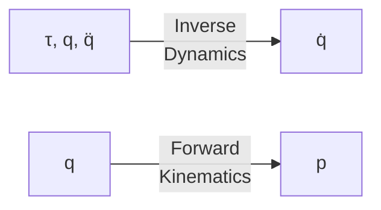
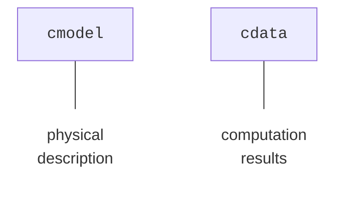
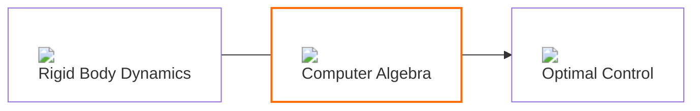
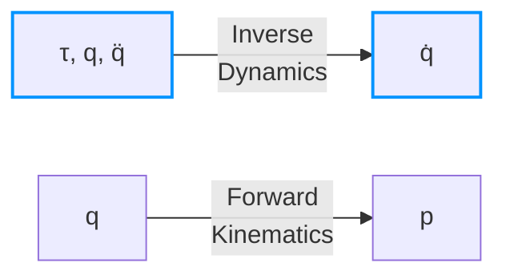
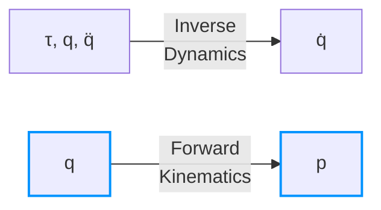
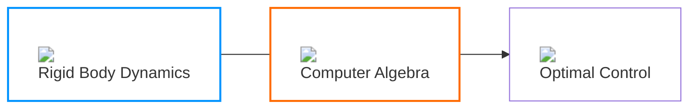
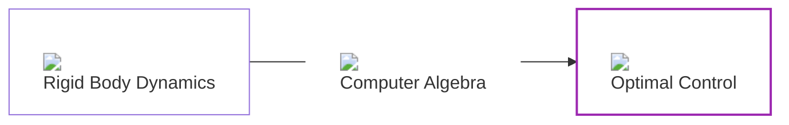

<div class="h-20"/>

<h1 class="text-sky-500">Rigid Body Dynamics</h1>

<div class="h-5"/>



---
title: Necessary Rigid Body Dynamics
layout: two-cols-header
class: text-right
---

<div class="h-10"/>
::left::
<div class="h-10"/>
<h1 class="text-sky-500">Rigid Body<br>Dynamics</h1>
<div class="h-5"/>

<v-switch>
  <template #0>


  </template>
  <template #2>



  </template>
  <template #4>
    <div class="flex justify-end">
      
      <!--  -->
    </div>
  </template>
  <template #5>
  <div class="absolute left-8em bottom-4em">



  </div>
  </template>
  <template #7>
  <div class="absolute bottom-6em right-8em">

```bash
CoM: @1=0, [@1, @1, 0.434408]
```

  </div>
    <div class="flex justify-end">
      
      <!--  -->
    </div>
  </template>
  <template #8>

  <div class="text-left absolute bottom-4em right-8em">

```bash
CoM:
@1=cos(q0_1),
@2=cos(q0_2),
@3=0.0126907,
@4=(@3*sin(q0_3)),
@5=sin(q0_2),
@6=(0.0221508+((@3*cos(q0_3))+0.0319443)),
@7=((@2*@4)+(@5*@6)),
@8=sin(q0_1),
@9=(0.0464442+(((@2*@6)-(@5*@4))+0.119653)),
@10=((@1*@7)+(@8*@9)),
@11=0.860899,

[((cos(q0_0)*@10)/@11), ((sin(q0_0)*@10)/@11), (((0.0117109+(((@1*@9)-(@8*@7))+0.0824688))+0.046919)/@11)]
```

  </div>
  </template>
  <template #9>



  </template>
  <template #10>



  </template>
  <template #11>


  </template>
</v-switch>

::right::

<div class="text-left">

````md magic-move {at: 1, lines: true} // [!code hl]
```python
import pinocchio.casadi as cpin
from pinocchio import RobotWrapper
```

```python {4|6-7|9} \\ [!code hl]
import pinocchio.casadi as cpin
from pinocchio import RobotWrapper

robot = RobotWrapper.BuildFromURDF("arm.urdf")

cmodel = cpin.Model(robot.model)
cdata = cmodel.createData()

nq = cmodel.nq
```

```python {12-13|8-11|8-11|*}
robot = RobotWrapper.BuildFromURDF("arm.urdf")

cmodel = cpin.Model(robot.model)
cdata = cmodel.createData()

nq = cmodel.nq

import casadi as ca

# CoM
q0 = ca.SX(robot.q0)
CoM = cpin.centerOfMass(cmodel, cdata, q0)
print('CoM:', CoM)
```

```python {11}
robot = RobotWrapper.BuildFromURDF("arm.urdf")

cmodel = cpin.Model(robot.model)
cdata = cmodel.createData()

nq = cmodel.nq

import casadi as ca

# CoM
q0 = ca.SX.sym("q0", nq)
CoM = cpin.centerOfMass(cmodel, cdata, q0)
print('CoM:', CoM)
```

```python {15-17|18-20|*}
import pinocchio.casadi as cpin
import casadi as ca
from pinocchio import RobotWrapper

robot = RobotWrapper.BuildFromURDF("arm.urdf")

cmodel = cpin.Model(robot.model)
cdata = cmodel.createData()

# Symbolics
q = ca.SX.sym("q", robot.nq)
qdot = ca.SX.sym("qdot", robot.nv)
tau = ca.SX.sym("tau", robot.nv)

# Inverse Dynamics
cpin.aba(cmodel, cdata, q, qdot, tau)
qddot = cdata.ddq
# Kinematics
cpin.framesForwardKinematics(cmodel, cdata, q)
p = cdata.oMf[-1].translation # endeffector pos.
```
````
</div>

<!-- highlighter -->
<div v-click="['6','7']" class="border-2 border-solid border-orange500 absolute right-14.6em top-12em text-orange500" style="width:6.5em; height:4.7em;"><code>casadi</code> &nbsp</div>
<div v-click="['6','7']" class="border-2 border-solid border-red500 absolute right-14.6em top-14em text-red500" style="width:4.2em; height:2.7em;"><code>numpy</code>&nbsp</div>

<div v-click="['8','9']" class="border-2 border-solid border-lime500 absolute right-8.5em top-14em text-lime500" style="width:15em; height:2.7em;"><code>SX</code> Symbolic&nbsp</div>

<!-- layout modifier -->

<style>
.two-cols-header {
  column-gap: 100px;
}
</style>

---
title: Additional Features
layout: image-left
image: /TechStack/pinocchio_logo.png
backgroundSize: contain
---

<div class="h-20"/>
<h1>Additional Features</h1>
<div class="h-5"/>


✅ *Constraint Forward Dynamics*

✅ *Collision with [Coal $^1$](https://github.com/coal-library/coal) (aka HPP-FCL)*

✅ *Programmatic Model Generation*

✅ *Lightweight Visualizer*

<!-- > And if you find some free time take a look at -->
> And even **more features** to discover at
> https://gepettoweb.laas.fr/doc/stack-of-tasks/pinocchio/devel/doxygen-html/


<Footnotes x= 'r'>
  <Footnote :number=1>https://github.com/coal-library/coal</Footnote>
</Footnotes>

---
title: Pipeline (Casadi)
class: text-center
---

<div class="h-20"/>

# Pipeline

<div class="h-10"/>

<v-switch>
  <template #0>



  </template>
  <template #1>



  </template>
</v-switch>
