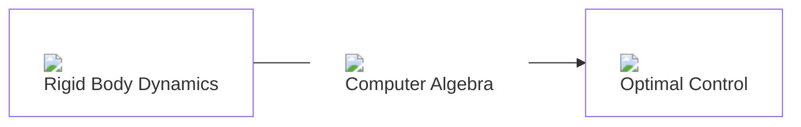
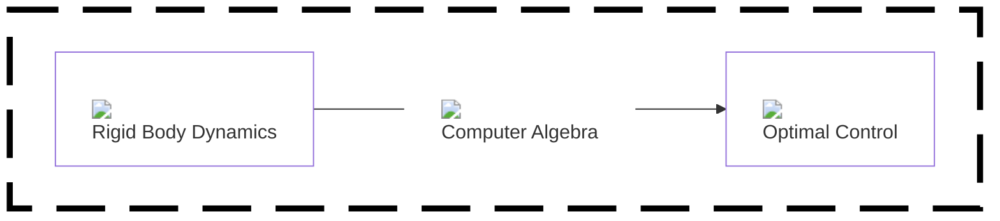

# Previous Tech Stack 📦

  

  

  

  

  

  

  

  

  

  

  

  

---
title: Current Tech Stack
level: 2
layout: center
class: text-center
---

# Updated Control Tech Stack 📦

  

  

  

  

  

  

  

  

  

  

  

  

---
title: Tech Pipeline
class: text-center
---

# Pipeline 🏭

<v-switch>
  <template #0>

  </template>
  <template #1>

  </template>

</v-switch>

  

