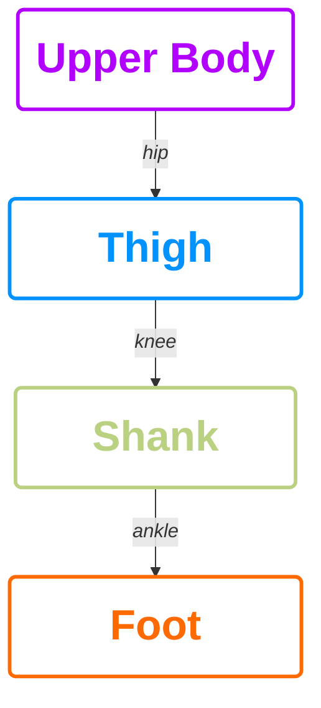
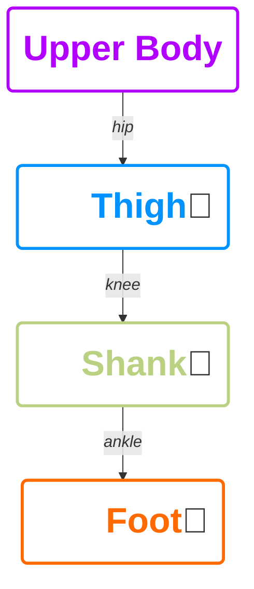
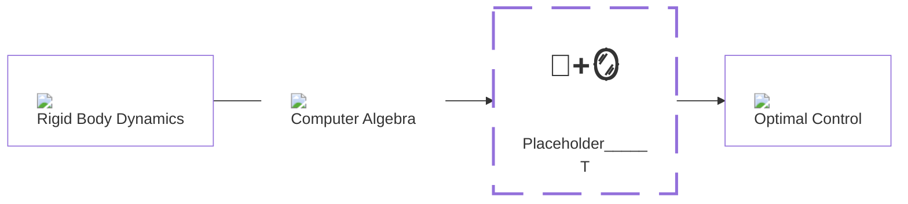

# How to Model `H`e`1`nz? 🧬

---
title: Lumped Model
layout: image-right
image: /frontal_gz.png
backgroundSize: contain
class: text-right
---

# Lumped Model 🤸

---
title: Lumped Model
layout: image-right
image: /side_gz.png
backgroundSize: contain
class: text-right
---

# Mirrored 🪞   Pitch Joints

---
title: Mirror Layer
class: text-center
---

<h1 class="text-center">Reduction Layer</h1>

