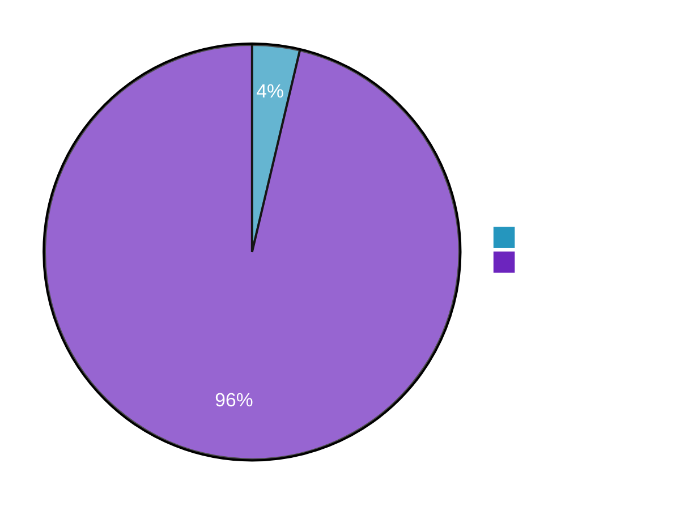

# What have all these videos in common?

  
  

  
  

  
  

  
  

  
  

  
  

  
  

  
  

  
  

  
  

  
  

  
  

<!--
TODO: multiple videos of roboerts getting pushed
-->

---
title: Bullet Dodge
hideInToc: true
layout: image
image: /bullet_dodge_neo.webp
---
<!--
TODO: make picture darker and put text in the middle
-->
---
title: Cover Page
hideInToc: true
layout: cover

coverAuthor: Dominic Zahn
coverAuthorUrl: https://github.com/DominicZahn
coverDate: 8/29/2025
#coverBackgroundUrl: /background_3.jpg
coverBackgroundUrl: /bullet_dodge_neo.webp

class: text-right
---

# PROJECT NEO

Getting `He1nz` to dodge like the chosen one.

<!--
Put your notes here!
-->
---
title: Push Recovery is overrated
layout: two-cols-header
hideInToc: true
---
# Push Recovery is overrated
::left::

::right::
*Some more explanasion or images.*
---
title: Why we even bother?
level: 1
layout: center
---
# Why even bother?
---
title: Reasons to learn Dodging
level: 2
layout: figure-side
figureUrl: /background_3.jpg
figureX: r
figureCaption: 
hideInToc:true
---
# Test
---
#layout: image
#class: text-right
#image: /bullet_dodge_neo.webp
hideInToc: true
layout: table-of-contents
---
# Table of Contents
<!--
Table of Contents
-->

