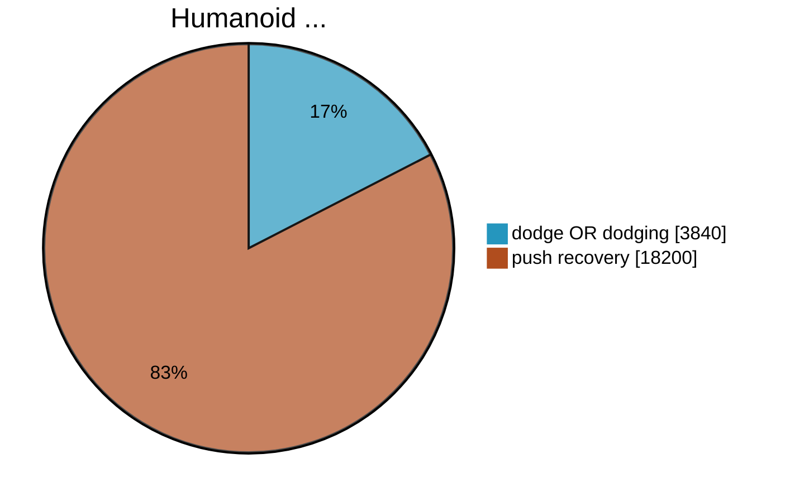

<!--
# What have all these videos in common?
-->

  
  

  
  

  
  

  
  

  
  

  
  

  
  

  
  

  
  

  
  

  
  

  
  

<!-- Sources:
https://www.youtube.com/watch?v=0VgxAnZKM14 CNN
https://www.youtube.com/watch?v=7b53L10RaIE Atrias
https://www.youtube.com/watch?v=LfcZ_EdTtGw G1
https://www.reddit.com/r/oddlyterrifying/comments/1j6h9q9/how_quickly_this_robot_gets_up_after_being_pushed/ reddit
https://www.youtube.com/watch?v=KSvLcr5HtNc OP3
https://www.youtube.com/watch?v=y3Why even bother?RIHnK0_NE Bosstown Dynamics
https://www.youtube.com/watch?v=aM-qb1yd5mU nadia
https://www.youtube.com/watch?v=2amzGvk97GE Agility Robotics
https://www.youtube.com/watch?v=w97H0eEKYvY TU Delft
-->
---
title: Bullet Dodge
hideInToc: true
layout: image
image: /bullet_dodge_neo.webp
---
<!--
TODO: make picture darker and put text "Dodging" in the middle
-->
---
title: Cover Page
hideInToc: true
layout: cover

coverAuthor: Dominic Zahn
coverAuthorUrl: https://github.com/DominicZahn
coverDate: 8/29/2025
#coverBackgroundUrl: /background_3.jpg
coverBackgroundUrl: /bullet_dodge_neo.webp

class: text-right text-white
---

# PROJECT NEO
Getting **H**e**1**nz to dodge like the chosen one.

<!--
Put your notes here!
-->
---
title: Push Recovery is overrated
layout: two-cols-header
hideInToc: true
class: text-center
---
# Dodging is underrated
::left::

::right::

<!--
data from 27.8. 17:00
-->

---
title: Why dodging bullets is important?
level: 1
layout: image-right
image: /shooting_at_robot.png
class: text-right
---
# Why Dodging Bullets is Important

- **First Bulletpoint**
- **Second Bulletpoint**
- **More Bulletpoints**

---
title: Reasons to learn Dodging
level: 2
layout: figure-side
figureUrl: /background_3.jpg
figureX: r
figureCaption: 
hideInToc:true
---
# Test
---
#layout: image
#class: text-right
#image: /bullet_dodge_neo.webp
hideInToc: true
layout: table-of-contents
---
# Table of Contents
<!--
Table of Contents
-->

