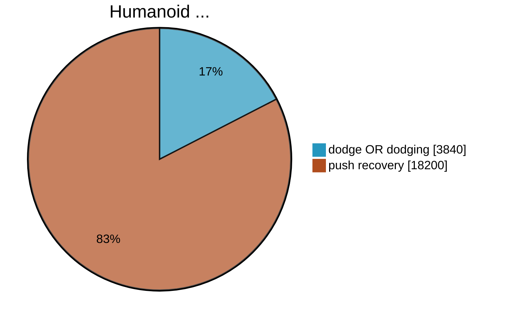

<!--
# What have all these videos in common?
-->

  

    
    1
  

  

    
    2
  

  

    
    3
  

  

    
    4
  

  

    
    5
  

  

    
    6
  

  

    
    7
  

  

    
    8
  

  

    
    9
  

  

    
    10
  

  

    
    11
  

  

    
    12
  

<Footnotes x='l' seperator>
    <Footnote :number=1>CNN</Footnote>
    <Footnote :number=2>OP3 Soccer</Footnote>
    <Footnote :number=3>TU Delft</Footnote>
    <Footnote :number=4>CNN</Footnote>
    <Footnote :number=5>OSU</Footnote>
    <Footnote :number=6>Unitree</Footnote>
    <Footnote :number=7>OCP3 Soccer</Footnote>
    <Footnote :number=8>CNN</Footnote>
    <Footnote :number=9>Corridor Digital</Footnote>
    <Footnote :number=10>IHMC Robotics</Footnote>
    <Footnote :number=11>Agility Robotics</Footnote>
    <Footnote :number=12>CNN</Footnote>
</Footnotes>

<!-- Sources:
https://www.youtube.com/watch?v=0VgxAnZKM14 CNN
https://www.youtube.com/watch?v=7b53L10RaIE (OSU) Atrias
https://www.youtube.com/watch?v=LfcZ_EdTtGw G1 (unitree)
https://www.reddit.com/r/oddlyterrifying/comments/1j6h9q9/how_quickly_this_robot_gets_up_after_being_pushed/ reddit
https://www.youtube.com/watch?v=KSvLcr5HtNc OP3 Soccer
https://www.youtube.com/watch?v=y3RIHnK0_NE&t=101s Bosstown Dynamics (Corridor Digital)
https://www.youtube.com/watch?v=aM-qb1yd5mU nadia (IHMC Robotics)
https://www.youtube.com/watch?v=2amzGvk97GE Agility Robotics
https://www.youtube.com/watch?v=w97H0eEKYvY TU Delft
-->
---
title: Bullet Dodge
hideInToc: true
layout: image
image: /bullet_dodge_neo.webp
---
<!--
TODO: make picture darker and put text "Dodging" in the middle
-->
---
title: Cover Page
hideInToc: true
layout: cover

coverAuthor: Dominic Zahn
coverAuthorUrl: https://github.com/DominicZahn
coverDate: 8/29/2025
#coverBackgroundUrl: /background_3.jpg
coverBackgroundUrl: /bullet_dodge_neo.webp

class: text-right text-white
---

# PROJECT NEO
Getting **H**e**1**nz to dodge like the chosen one.

<!--
Put your notes here!
-->
---
title: Dodging is Underrepresented
layout: two-cols-header
hideInToc: true
class: text-center
---
# Dodging is Underrepresented
::left::

::right::

<!--
data from 27.8. 17:00
-->

---
title: Why Dodging Bullets is Interesting 💡
level: 1
layout: image-right
image: /shooting_at_robot.png
class: text-right
hideInToc: true
---
# Why Dodging Bullets is Intresting

<v-clicks>

**No Killer-Robots** ❌

**Effective Evasion Manauever** ✅

**Avoids Damage** ✅

**Investigating Stability Criterias** ✅

**Applyed Mathematical Optimization** ✅

**Exploring Platform Limitations** ✅
<!--
> **More Fun than Getting Hit** 🤖
-->

> *"I don`t like to get hit, who likes it?"*
>
> -- Wladimir Klitschko

</v-clicks>

---
layout: image-right
class: text-right
image: /jones.webp
hideInToc: true
---
# Outline

    

        Unitree H1 ↔
    

    

        <b>Powerfull Platform</b> 
    

    
🦾

    

    

        Docker ↔
    

    

        <b>Portable Environment</b> 
    

    
📦

    

        ROS 2 ↔
    

    

        <i>Jazzy</i> 
    

    
🧪

    

    

    

    

        <b>Toolbox</b> 
    

    
🧰

    

        Optimization  ↔
    

    

        <i>NLOPT</i>
    

    
📈

    

        Dynamics ↔
    

    

        <i>RBDL</i>
    

    
🦿

    

        Vision ↔
    

    

        <i>OpenCv</i>
    

    
🥽

    

        Optimal Control ↔
    

    

        <i>Biorbd</i>
    

    
🕹️

<Footnotes x='l'>
    <Footnote :number=1>filmfreedonia.com</Footnote>
</Footnotes>

---
image: /bullet_dodge_neo.webp
hideInToc: true
layout: table-of-contents
class: text-left
---
# Table of Contents
<!--
Table of Contents
-->

---
title: Formulation of Optimization Problem 📈
layout: image-right
image: /robot_neo.png
class: text-left
---
# Optimization Problem

> ### Problem:
> - **avoid obstacles** on head level
> - **feet** are static on the ground
>
> $=>$ $\text{const.}$ Polygon of Support
> - **statically stable**
>
> $=>$ $\text{CoP} \in \text{PoS}$

#### Acronyms
Center of Preassure = $\text{CoP}$ \
Polygon of Support = $\text{PoS}$

---
layout: two-cols
class: text-left
hideInToc: true
---
# Optimization   Problem

> ### Problem:
> - **avoid obstacles** on head level
> - **feet** are static on the ground
>
> $=>$ $\text{const.}$ Polygon of Support
> - **statically stable**
>
> $=>$ $\text{CoP} \in \text{PoS}$

#### Acronyms
Center of Preassure = $\text{CoP}$ \
Polygon of Support = $\text{PoS}$ \
Center of Mass = $\text{CoM}$

::right::

### Mathematical Formulation $(I)$

<v-switch>
<template #0>
$$
\begin{align}
    p_{\text{head}} &\ne p_{\text{obstacle}} \\
    \nonumber \\
    p_{\text{leftFoot}} &\in \text{GND} \\
    \text{AND}\quad p_{\text{rightFoot}} &\in \text{GND} \\
    \nonumber \\
    p_\text{CoP} &\in \text{PoS} \\
    \xRightarrow{\text{static}} p_\text{CoP} &:= 
    \begin{bmatrix}
        p_\text{CoM}.x \\
        p_\text{CoM}.y \\
        0
    \end{bmatrix}
\end{align}
$$
</template>

<template #1>
$$
\begin{align}
    p_{\text{head}}^\text{world} &\ne p_{\text{obstacle}}^\text{world} \\
    \nonumber \\
    p_{\text{leftFoot}}^\text{world} &\in \text{GND} \\
    \text{AND}\quad p_{\text{rightFoot}}^\text{world} &\in \text{GND} \\
    \nonumber \\
    p_\text{CoP}^\text{world} &\in \text{PoS}^\text{world} \\
    \xRightarrow{\text{static}} p_\text{CoP}^\text{world} &:= 
    \begin{bmatrix}
        p_\text{CoM}^\text{world}.x \\
        p_\text{CoM}^\text{world}.y \\
        0
    \end{bmatrix}
\end{align}
$$
</template>
</v-switch>

---
title: Stability ⚖
level: 1
---
# Stability
---
title: Center of Mass $(\text{CoM})$ and Center of Preassure $(\text{CoP})$ 🎯
level: 2
---
# Center of Mass $(\text{CoM})$ 🎯

---
hideInToc: true
level: 2
---
# Center of Preassure $(\text{CoP})$

---
level: 2
---
# Polygon of Support $(\text{PoS})$ 👣

---
level: 2
---
# Stability Criteria 📐

---
level: 2
layout: center
---
# Live Demo🥋

---
level: 1
---
# Actuation 🕹

---
level: 1
---
# Executing Optimization ✅

---
level: 2
layout: center
---
# Live Demo🥋
---
level: 1
---
# Future Work 🔭

---
