```mermaid
%%{
  init: {
    'theme': 'neutral'
  }
}%%

flowchart TB
    subgraph point_calculator
        CenterOfMass[CenterOfMass 🎯]
        PolygonOfSupport[PolygonOfSupport 👣]
    end

    subgraph ros2_heinz[ros2_heinz *1*]
        subgraph h1_gazebo_sim
            subgraph h1_bringup
                h1_rviz.launch
                h1_gazebo_sim.launch
            end
            subgraph h1_description
            end
        end
    end
    subgraph Thirdparty
    subgraph ROS2
        rclcpp
        msgs
        tf2
    end
    RBDL
    Eigen3
    Boost
    end

    point_calculator -.-> ROS2
    point_calculator -.-> RBDL
    ROS2 -.-> Boost
    RBDL -.-> Eigen3

    point_calculator  -.-> h1_description

    Stability[Stability ⚖]
    style Stability stroke-dasharray: 5 5

    Stability -.-> RBDL
    Stability -.-> h1_description
    PolygonOfSupport -.-> Stability

    stability.launch[stability.launch 🚀]

    stability.launch --launch--> h1_bringup
    stability.launch --run--> CenterOfMass
    stability.launch --run--> PolygonOfSupport
```

<!--
# What have all these videos in common?
-->

  

    
    1
  

  

    
    2
  

  

    
    3
  

  

    
    4
  

  

    
    5
  

  

    
    6
  

  

    
    7
  

  

    
    8
  

  

    
    9
  

  

    
    10
  

  

    
    11
  

  

    
    12
  

<Footnotes x='l' seperator>
    <Footnote :number=1>CNN</Footnote>
    <Footnote :number=2>OP3 Soccer</Footnote>
    <Footnote :number=3>TU Delft</Footnote>
    <Footnote :number=4>CNN</Footnote>
    <Footnote :number=5>OSU</Footnote>
    <Footnote :number=6>Unitree</Footnote>
    <Footnote :number=7>OCP3 Soccer</Footnote>
    <Footnote :number=8>CNN</Footnote>
    <Footnote :number=9>Corridor Digital</Footnote>
    <Footnote :number=10>IHMC Robotics</Footnote>
    <Footnote :number=11>Agility Robotics</Footnote>
    <Footnote :number=12>CNN</Footnote>
</Footnotes>

<!-- Sources:
https://www.youtube.com/watch?v=0VgxAnZKM14 CNN
https://www.youtube.com/watch?v=7b53L10RaIE (OSU) Atrias
https://www.youtube.com/watch?v=LfcZ_EdTtGw G1 (unitree)
https://www.reddit.com/r/oddlyterrifying/comments/1j6h9q9/how_quickly_this_robot_gets_up_after_being_pushed/ reddit
https://www.youtube.com/watch?v=KSvLcr5HtNc OP3 Soccer
https://www.youtube.com/watch?v=y3RIHnK0_NE&t=101s Bosstown Dynamics (Corridor Digital)
https://www.youtube.com/watch?v=aM-qb1yd5mU nadia (IHMC Robotics)
https://www.youtube.com/watch?v=2amzGvk97GE Agility Robotics
https://www.youtube.com/watch?v=w97H0eEKYvY TU Delft
-->
---
title: Bullet Dodge
hideInToc: true
layout: image
image: /bullet_dodge_neo.webp
---
<!--
TODO: make picture darker and put text "Dodging" in the middle
-->
---
title: Cover Page
hideInToc: true
layout: cover

coverAuthor: Dominic Zahn
coverAuthorUrl: https://github.com/DominicZahn
coverDate: 8/29/2025
#coverBackgroundUrl: /background_3.jpg
coverBackgroundUrl: /bullet_dodge_neo.webp

class: text-right text-white
---

# PROJECT NEO
Getting **H**e**1**nz to dodge like the chosen one.

<!--
Put your notes here!
-->
---
title: Dodging is Underrepresented
layout: two-cols-header
hideInToc: true
class: text-center
---
# Dodging is Underrepresented
::left::

::right::

<!--
data from 27.8. 17:00
-->

---
title: Why Dodging Bullets is Interesting 💡
level: 1
layout: image-right
image: /shooting_at_robot.png
class: text-right
hideInToc: true
---
# Why Dodging Bullets is Intresting

<v-clicks>

**No Killer-Robots** ❌

**Effective Evasion Manauever** ✅

**Avoids Damage** ✅

**Investigating Stability Criterias** ✅

**Applyed Mathematical Optimization** ✅

**Exploring Platform Limitations** ✅
<!--
> **More Fun than Getting Hit** 🤖
-->

> *"I don`t like to get hit, who likes it?"*
>
> -- Wladimir Klitschko

</v-clicks>

---
layout: image-right
class: text-right
image: /jones.webp
hideInToc: true
---
# Outline

    

        Unitree H1 ↔
    

    

        <b>Powerfull Platform</b> 
    

    
🦾

    

    

        Docker ↔
    

    

        <b>Portable Environment</b> 
    

    
📦

    

        ROS 2 ↔
    

    

        <i>Jazzy</i> 
    

    
🧪

    

    

    

    

        <b>Toolbox</b> 
    

    
🧰

    

        Optimization  ↔
    

    

        <i>NLOPT</i>
    

    
📈

    

        Dynamics ↔
    

    

        <i>RBDL</i>
    

    
🦿

    

        Optimal Control ↔
    

    

        <i>Bioptim</i>
    

    
🕹️

    

        Vision ↔
    

    

        <i>OpenCv</i>
    

    
🥽

<Footnotes x='l'>
    <Footnote :number=1>filmfreedonia.com</Footnote>
</Footnotes>

---
image: /bullet_dodge_neo.webp
hideInToc: true
layout: table-of-contents
class: text-left
---
# Table of Contents
<!--
Table of Contents
-->

---
title: Formulation of Optimization Problem 📈
layout: image-right
image: /robot_neo.png
class: text-left
---
# Optimization Problem 📈

> ### Problem:
> - **avoid obstacles** on head level
> - **feet** are static on the ground
>
> $=>$ $\text{const.}$ Polygon of Support
> - **statically stable**
>
> $=>$ $\text{CoP} \in \text{PoS}$

#### Acronyms
Center of Preassure = $\text{CoP}$ \
Polygon of Support = $\text{PoS}$

---
layout: two-cols
class: text-left
hideInToc: true
---
# Optimization   Problem  📈

> ### Problem:
> - **avoid obstacles** on head level
> - **feet** are static on the ground
>
> $=>$ $\text{const.}$ Polygon of Support
> - **statically stable**
>
> $=>$ $\text{CoP} \in \text{PoS}$

#### Acronyms
Center of Preassure = $\text{CoP}$ \
Polygon of Support = $\text{PoS}$ \
Center of Mass = $\text{CoM}$

::right::

### Mathematical Formulation $(I)$

<v-switch>
<template #0>
$$
\begin{align}
    p_{\text{head}} &\ne p_{\text{obstacle}} \\
    \nonumber \\
    p_{\text{leftFoot}} &\in \text{GND} \\
    \text{AND}\quad p_{\text{rightFoot}} &\in \text{GND} \\
    \nonumber \\
    p_\text{CoP} &\in \text{PoS} \\
    \xRightarrow{\text{static}} p_\text{CoP} &:= 
    \begin{bmatrix}
        p_\text{CoM}.x \\
        p_\text{CoM}.y \\
        0
    \end{bmatrix}
\end{align}
$$
</template>

<template #1>
$$
\begin{align}
    p_{\text{head}}^\text{world} &\ne p_{\text{obstacle}}^\text{world} \\
    \nonumber \\
    p_{\text{leftFoot}}^\text{world} &\in \text{GND} \\
    \text{AND}\quad p_{\text{rightFoot}}^\text{world} &\in \text{GND} \\
    \nonumber \\
    p_\text{CoP}^\text{world} &\in \text{PoS}^\text{world} \\
    \xRightarrow{\text{static}} p_\text{CoP}^\text{world} &:= 
    \begin{bmatrix}
        p_\text{CoM}^\text{world}.x \\
        p_\text{CoM}^\text{world}.y \\
        0
    \end{bmatrix}
\end{align}
$$
</template>
</v-switch>

---
level: 1
layout: image-right
image: /R1.jpg
class: "text-center"
---

# Static Stability ⚖

<Footnotes x='l'>
    <Footnote :number=1>Unitree</Footnote>
</Footnotes>

---
title: Center of Mass $(\text{CoM})$ and Center of Preassure $(\text{CoP})$ 🎯
level: 2
layout: two-cols
---
# Center of Mass  $(\text{CoM})$ 🎯

::right::

<Footnotes x='l'>
    <Footnote :number=1><a href="https://github.com/K-d4wg/ros2_heinz">K-d4wg</a></Footnote>
</Footnotes>
---
hideInToc: true
level: 2
layout: two-cols
---
# Center of Mass  $(\text{CoM})$ 🎯

    

        
    

    

        
    

    

        
    

    

        
    

::right::

<v-switch>
<template #1>

> ### 🔊Publisher: `/CoM`

</template>
<template #2>

> ### 🔊Publisher: `/CoM` $\xRightarrow{z=0}$ `/CoP`

</template>
</v-switch>
---
hideInToc: true
level: 2
layout: image-right
image: /screenshots/CoM.png
class: text-right
---

# Center of Mass $(\text{CoM})$ 🎯

### Legend

**CoM** 🟠

**CoP** 🔵

---
level: 2
layout: two-cols
---
# Polygon of Support $(\text{PoS})$ 👣
<video
    src="/screenshots/contacts.webm"  autoplay
    width="220em"
    loop
    muted
    playsinline
    class="mx-auto rounded-xl shadow-lg max-h-[100vh]"
/>

::right::

<v-click>

```mermaid
%%{
  init: {
    'theme': 'neutral'
  }
}%%

flowchart TB
    subgraph point_calculator
        CenterOfMass[CenterOfMass 🎯]
        PolygonOfSupport[PolygonOfSupport 👣]
    end

    subgraph ros2_heinz[ros2_heinz *1*]
        subgraph h1_gazebo_sim
            subgraph h1_bringup
                h1_rviz.launch
                h1_gazebo_sim.launch
            end
            subgraph h1_description
            end
        end
    end
    subgraph Thirdparty
    subgraph ROS2
        rclcpp
        msgs
        tf2
    end
    RBDL
    Eigen3
    Boost
    end

    point_calculator -.-> ROS2
    point_calculator -.-> RBDL
    ROS2 -.-> Boost
    RBDL -.-> Eigen3

    point_calculator  -.-> h1_description

```

> ### 🔊Publisher: `/PoS`

</v-click>
---
hideInToc: true
level: 2
layout: two-cols
---
# Polygon of Support $(\text{PoS})$ 👣
<video
    src="/screenshots/PoS.webm"  autoplay
    width="220em"
    loop
    muted
    playsinline
    class="mx-auto rounded-xl shadow-lg max-h-[100vh]"
/>

::right::

> ### 🔊Publisher: `/PoS` $\xRightarrow{\text{Rviz}}$ `/vis_PoS`

---
#hideInToc: true
level: 3
layout: image-right
image: /screenshots/gz_faceplant.png
class: text-right
transition: fade
---

# Gazebo $\xRightarrow{}$ Rviz

<v-clicks>

### Flexibel Joint Control ✅
### Full Visualization ✅
### No Jiggeling ✅
### Better Performance ✅

</v-clicks>

<v-clicks>

### No Physics ❌
### No Fixed Global Frame ❌
### No Live Contacts ❌

</v-clicks>

<v-click>

## $\xRightarrow{}$ Fixed $\text{PoS}$ 🔒

</v-click>
---
level: 2
layout: two-cols
class: text-left
---

# Stability Criteria 📐

## Min Edge Distance
#### 🚫 No Continuity
#### ✅ Uses PoS Borders
#### ✅ Adjusts to Shape

::right::

🔴: low values | 🔵: high values

## Centroid Distance

#### ✅ Continuious
#### 🚫 Ignores PoS Borders
#### ⚠ Only Indirect Influence of Shape

---
level: 3
layout: two-cols
hideInToc: true
---

# Stability ⚖

<h2>📚Stability Library</h2>
<h4><b>- Stability Criteria</b></h4>
<h4><b>- Helper Functions</b></h4>

<h2>🔗Depends on</h2>
<h4><b> - RBDL</b></h4>
<h4><b> - h1_description</b></h4>

::right::

---
level: 2
layout: two-cols
hideInToc: true
---

# Launch Files

<h2> 🚀 stability.launch</h2>
<h4><i>run</i> <b>CenterOfMass 🎯</b></h4>
<h4><i>run</i> <b>PolygonOfSupport 👣</b></h4>
<h4><i>launch</i> <b>rviz</b> <i>OR</i> <b>gazebo🧮</b></h4>

::right::

---
level: 1
layout: two-cols
---
# Actuation 🕹

<h2>🔊Publishing to <i>/joint_states</i></h2>
<h4>- 🍎<b>Ignore Physics</b></h4>
<h4>- ⏱<b>Instant Movement</b></h4>

::right::
<video
    src="/screenshots/moving.webm" autoplay
    width="500em"
    loop
    muted
    playsinline
    class="mx-auto rounded-xl shadow-lg max-h-[100vh]"
/>

---
level: 2
layout: two-cols
hideInToc: true
---

# Dependencies 🔗

<v-click>
    
    <h2 class="text-center">🚨 <b>Dependency Chaos</b> 🚨</h2>
</v-click>

::right::

---
level: 2
layout: two-cols
class: text-center
---

# RbdlWrapper 🛠

```mermaid
%%{
  init: {
    'theme': 'neutral'
  }
}%%

flowchart TB
    subgraph point_calculator
        CenterOfMass[CenterOfMass 🎯]
        PolygonOfSupport[PolygonOfSupport 👣]
    end

    stability.launch[stability.launch 🚀]

    subgraph ros2_heinz[ros2_heinz *1*]
        subgraph h1_gazebo_sim
            subgraph h1_bringup
                h1_rviz.launch
                h1_gazebo_sim.launch
            end
            subgraph h1_description
            end
        end
    end

    subgraph neo_utils
        RbdlWrapper[RbdlWrapper 🛠]
        Stability[Stability ⚖]
        style RbdlWrapper stroke-dasharray: 5 5
        style Stability stroke-dasharray: 5 5
    end

    point_calculator -.-> neo_utils

    dodge_it -.-> RbdlWrapper

    stability.launch --launch--> h1_bringup
    stability.launch --run--> CenterOfMass
    stability.launch --run--> PolygonOfSupport

    RbdlWrapper -.-> h1_description

```

::right::

<v-switch>
<template #0>

</template>
<template #1>

</template>
</v-switch>

---
level: 1
hideInToc: true
layout: center
class: text-left
---

# Framework Overview 🧰

```mermaid
%%{
  init: {
    'theme': 'neutral'
  }
}%%

flowchart TB
    subgraph point_calculator
        CenterOfMass[CenterOfMass 🎯]
        PolygonOfSupport[PolygonOfSupport 👣]
    end

    subgraph dodge_it
        Smith[Smith 🤺]
        Neo[Neo 🤸]
        stability.launch[stability.launch 🚀]
    end

    subgraph ros2_heinz[ros2_heinz *1*]
        subgraph h1_gazebo_sim
            subgraph h1_bringup
                h1_rviz.launch
                h1_gazebo_sim.launch
            end
            subgraph h1_description
            end
        end
    end

    subgraph neo_utils
        RbdlWrapper[RbdlWrapper 🛠]
        Stability[Stability ⚖]
        style RbdlWrapper stroke-dasharray: 5 5
        style Stability stroke-dasharray: 5 5
    end

    point_calculator -.-> neo_utils
    
    Smith -.-> neo_utils
    Neo -.-> neo_utils

    stability.launch --launch--> h1_bringup
    stability.launch --run--> CenterOfMass
    stability.launch --run--> PolygonOfSupport

    RbdlWrapper -.-> h1_description

```

<Footnotes x='l'>
    <Footnote :number=1><a href="https://github.com/K-d4wg/ros2_heinz">K-d4wg</a></Footnote>
</Footnotes>
---
level: 2
layout: center
class text-center
---
# Tech Stack Overview 📦

  

  

  

  

  

  

  

  

  

  

  

  

---
level: 1
layout: image-right
image: /TechStack/nlopt_exp.png
class: text-center
---

# Executing Optimization 🎲

---
hideInToc: true
level: 2
layout: image-right
image: /screenshots/well_thats_an_optimum.png
---
# Root $\neq$ World

### Optimization **(I)**
$$
\begin{align}
    p_{\text{head}}^\text{world} &\ne p_{\text{obstacle}}^\text{world} \\
    \nonumber \\
    p_{\text{leftFoot}}^\text{world} &\in \text{GND} \\
    \text{AND}\quad p_{\text{rightFoot}}^\text{world} &\in \text{GND} \\
    \nonumber \\
    p_\text{CoP}^\text{world} &\in \text{PoS}^\text{world} \\
    \xRightarrow{\text{static}} p_\text{CoP}^\text{world} &:= 
    \begin{bmatrix}
        p_\text{CoM}^\text{world}.x \\
        p_\text{CoM}^\text{world}.y \\
        0
    \end{bmatrix}
\end{align}
$$

---
hideInToc: true
level: 2
layout: image-right
image: /screenshots/dodging_literally_everything.png
---
# Root $\neq$ World

### Optimization **(II)**
$$
\begin{align}
    p_{\text{head}}^\text{leftFoot} &\ne p_{\text{obstacle}}^\text{leftFoot} \\
    \nonumber \\
    p_{\text{leftFoot}}^\text{leftFoot} &\in \text{GND} \\
    \text{AND}\quad p_{\text{rightFoot}}^\text{leftFoot} &\in \text{GND} \\
    \nonumber \\
    p_\text{CoP}^\text{leftFoot} &\in \text{PoS}^\text{leftFoot} \\
    \xRightarrow{\text{static}} p_\text{CoP}^\text{leftFoot} &:= 
    \begin{bmatrix}
        p_\text{CoM}^\text{leftFoot}.x \\
        p_\text{CoM}^\text{leftFoot}.y \\
        0
    \end{bmatrix}
\end{align}
$$

---
hideInToc: true
level: 2
layout: image-right
image: /screenshots/dodging_literally_everything.png
class: text-left
---

---
hideInToc: true
level: 2
layout: figure
figureUrl: /screenshots/face_down.png
figureCaption: 🔗 unsynced Legs + 🎱 bad Start Configuration
---
# Just a Little Push 🥊

---
level: 2
layout: image-right
image: /dojo_render.jpg
class: text-center
---

#  🥋 <b>Live Demo</b> 🥋 

<Footnotes x='l'>
    <Footnote :number=1>learnvray.com</Footnote>
</Footnotes>
---
hideInToc: true
level: 2
layout: figure
figureUrl: /screenshots/finally.png
class: text-center
---
# 🎉Welcome `He1nz` the chosen one🎉
---
level: 1
---
# Future Work 🔭

---
hideInToc: true
layout: end
---
# Thank you for following the White Rabbit. 🐇
---
